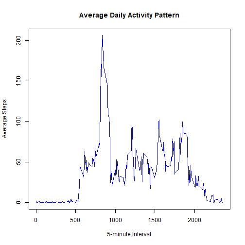
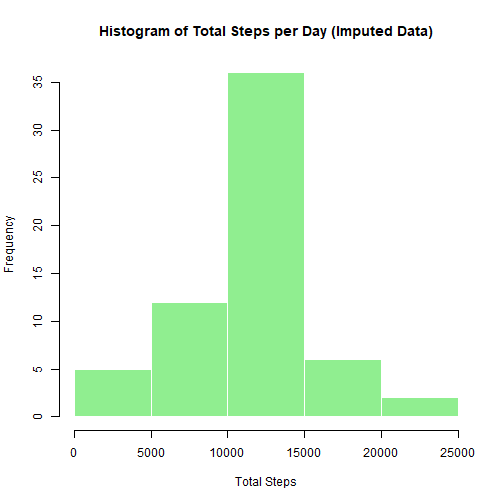
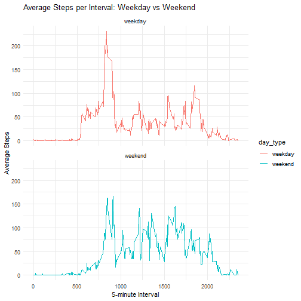

 ---
title: "Activity Monitoring Data Analysis"
author: "Sara Alyafei"
date: "2025-09-08"
output: html_document
---


``` r
# Load necessary libraries
library(dplyr)
library(ggplot2)

# Read the data
activity_data <- read.csv("activity.csv")
```

```
## Warning in file(file, "rt"): cannot open file 'activity.csv': No
## such file or directory
```

```
## Error in file(file, "rt"): cannot open the connection
```

``` r
activity_data$date <- as.Date(activity_data$date)
# Question 1
# Total steps per day, mean, and median
total_steps_per_day <- activity_data %>%
  group_by(date) %>%
  summarise(total_steps = sum(steps, na.rm = TRUE))

mean_steps <- mean(total_steps_per_day$total_steps)
median_steps <- median(total_steps_per_day$total_steps)

# Question 2
# Average daily activity pattern and time series plot
avg_steps_interval <- activity_data %>%
  group_by(interval) %>%
  summarise(avg_steps = mean(steps, na.rm = TRUE))

plot(avg_steps_interval$interval, avg_steps_interval$avg_steps, type="l",
     main="Average Daily Activity Pattern",
     xlab="5-minute Interval", ylab="Average Steps",
     col="blue")
```



``` r
max_interval <- avg_steps_interval[which.max(avg_steps_interval$avg_steps), ]

# Question 3
# Imputing missing values
imputed_data <- activity_data
for (i in 1:nrow(imputed_data)) {
  if (is.na(imputed_data$steps[i])) {
    interval_value <- imputed_data$interval[i]
    mean_value <- avg_steps_interval$avg_steps[avg_steps_interval$interval == interval_value]
    imputed_data$steps[i] <- mean_value
  }
}

# Question 4
# Histogram of total steps per day after imputation
total_steps_imputed <- imputed_data %>%
  group_by(date) %>%
  summarise(total_steps = sum(steps))

hist(total_steps_imputed$total_steps,
     main="Histogram of Total Steps per Day (Imputed Data)",
     xlab="Total Steps",
     col="lightgreen",
     border="white")
```



``` r
mean_steps_imp <- mean(total_steps_imputed$total_steps)
median_steps_imp <- median(total_steps_imputed$total_steps)

# Question 5
# Average steps per interval by weekday/weekend
imputed_data$day_type <- ifelse(weekdays(imputed_data$date) %in% c("Saturday", "Sunday"),
                                "weekend", "weekday")

avg_steps_daytype <- imputed_data %>%
  group_by(interval, day_type) %>%
  summarise(avg_steps = mean(steps), .groups = "drop")

ggplot(avg_steps_daytype, aes(x=interval, y=avg_steps, color=day_type)) +
  geom_line() +
  facet_wrap(~day_type, nrow=2) +
  labs(title="Average Steps per Interval: Weekday vs Weekend",
       x="5-minute Interval", y="Average Steps") +
  theme_minimal()
```



``` r
# Question 6
# Identify interval with maximum average steps
max_interval_daytype <- avg_steps_daytype[which.max(avg_steps_daytype$avg_steps), ]
max_interval_daytype
```

```
## # A tibble: 1 × 3
##   interval day_type avg_steps
##      <int> <chr>        <dbl>
## 1      835 weekday       230.
```
